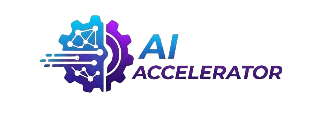

# AI Accelerator Platform

## Project Logo

<p align="center">
  
</p>

**AI Accelerator** is an end-to-end platform designed to **deploy, monitor, and govern machine learning models in production** in a secure, scalable, and auditable way.

[](https://pypi.org/project/ai-accelerator/)
[](https://www.python.org/downloads/)
[](https://opensource.org/licenses/Apache-2.0)

The project aims to be a **core MLOps foundation** for companies, ML teams, and developers who want to move from experimental notebooks to **real production-grade AI systems**.

## Project Overview

AI Accelerator is a modular MLOps platform built for operational AI in real environments.
It combines a CLI-first workflow with backend APIs, runtime services, and policy controls so teams can ship and operate models safely.

Platform layers:

- Control layer: `aiac` CLI for daily operations, automation, and incident handling.
- API layer: Django + DRF services for auth, deployment, monitoring, governance, and admin operations.
- Runtime layer: FastAPI-based model runtimes generated from approved model versions.
- Async layer: Celery-powered background execution for deployment lifecycle and policy workflows.
- Orchestration layer: local Docker runtime plus optional Kubernetes/Minikube support for scalable serving.

End-to-end lifecycle covered by the platform:

1. Onboard users, authenticate with JWT, and enforce role boundaries.
2. Register projects and model versions with approval workflow support.
3. Deploy, redeploy, stop, delete, and inspect live model services.
4. Collect runtime telemetry, records, alerts, drift signals, and cost metrics.
5. Apply and enforce governance policies, then resolve/reopen violations.
6. Audit actions, export logs, and operate through both interactive and scripted CLI flows.

## Application Breakdown

### Deployment App (`deployment`)

Primary role: convert approved model artifacts into running inference services.

What it manages:

- Project and model-version registries.
- Model approval lifecycle (`approve`, `reject`, `retire`) and approval history.
- Deployment lifecycle states (`PENDING`, `DEPLOYING`, `ACTIVE`, `FAILED`, etc.).
- Runtime endpoint generation (predict, explain-decision, health, docs, service UI).
- Service operations (deploy, redeploy, stop, delete, preflight checks).
- Advanced runtime tooling (advisor, service catalog, traffic shadow).
- Kubernetes operations (preflight, bootstrap, deploy, status, scale, HPA, rollback, delete).

Operational value:

- Standardizes safe releases and rollback paths.
- Reduces deployment drift between local and production-like environments.
- Makes rollout behavior observable, automatable, and policy-aware.

### Monitoring App (`monitoring`)

Primary role: continuously observe deployed systems and detect behavior changes.

What it manages:

- Deployment telemetry (CPU, RAM, latency, request/error counters).
- Deployment records and trend-oriented summaries.
- Drift detection workflows with configurable thresholds/profiles.
- Sample ingestion pipelines (JSON/CSV) for drift baselines.
- Alert generation, filtering, and resolution workflows.
- Cost intelligence, efficiency scoring, and optimization recommendations.

Operational value:

- Detects issues before they become incidents.
- Helps teams tune reliability and performance.
- Provides data needed for capacity and cost decisions.

### Governance App (`governance`)

Primary role: define and enforce policy controls over deployment and monitoring behavior.

What it manages:

- Policy definitions (including metadata/rules payloads and target scope).
- Policy-to-deployment assignment.
- Violation detection, severity tracking, and violation actions (resolve/reopen/bulk resolve).
- Policy engine execution, metrics, and debug tooling.
- Governance insights and alert logs.

Operational value:

- Adds compliance guardrails to ML operations.
- Improves traceability and accountability.
- Enables policy-driven control instead of ad hoc rules.

### Authentication and User App (`users` / `auth`)

Primary role: identity and access control.

What it manages:

- Account registration and login/logout.
- JWT issuance and token refresh flow.
- Password reset and secure token flows.
- Role-based access boundaries for platform actions.

Operational value:

- Secures operational endpoints.
- Supports separation of duties (admin/engineer/auditor patterns).

### Admin App (`admin`)

Primary role: provide operational user administration and audit controls through CLI/API.

What it manages:

- User discovery and profile lookup.
- User state changes (activate, deactivate, soft-delete).
- Role changes (promote/demote admin).
- Administrative password reset actions.
- Audit log listing and export (CSV/JSON).

Operational value:

- Centralizes day-2 user operations.
- Improves governance and forensic visibility with auditable admin actions.

### Server App (`server`)

Primary role: manage local API runtime lifecycle from the CLI.

What it manages:

- Background server run/status/stop workflow.
- Optional auto-migration before startup.
- User-friendly startup diagnostics and log handling.

Operational value:

- Reduces setup friction for package users.
- Enables one-terminal operations for CLI-first usage.

## How Apps Work Together

- `auth/users` establishes identity, tokens, and role boundaries for every request.
- `deployment` handles model/project lifecycle and creates runtime endpoints for inference.
- Runtime traffic and health signals flow into `monitoring` (stats, records, alerts, drift, cost).
- `governance` evaluates deployment/monitoring signals against policy rules and records violations.
- `admin` provides controlled user/audit operations and enforcement support.
- `server` simplifies local API lifecycle (`run`, `status`, `stop`) so operators can run all CLI workflows consistently.

Together, these apps form a closed operational loop: authenticate -> deploy -> observe -> enforce -> audit -> improve.

## Installation

### Prerequisites

- Python `3.10` to `3.12`
- `pip` updated to a recent version
- Docker (recommended for deployment/runtime workflows)

### From PyPI (Recommended)

```bash
# Optional but recommended: create and activate a virtual environment first
# python -m venv .venv
# source .venv/bin/activate  # On Windows: .venv\Scripts\activate

pip install ai-accelerator
```

Optional extras:

```bash
# Kubernetes commands support
pip install "ai-accelerator[k8s]"

# Development tooling
pip install "ai-accelerator[dev]"
```

### From Source (Editable)

```bash
git clone https://github.com/AyoubArdem/ai-accelerator.git
cd ai-accelerator
pip install -e .
```

### Development Setup (Contributors)

Use this flow for local development and testing:

```bash
git clone https://github.com/AyoubArdem/ai-accelerator.git
cd ai-accelerator

# Create virtual environment
python -m venv env1
source env1/bin/activate  # On Windows: env1\Scripts\activate

# Upgrade packaging tools
python -m pip install --upgrade pip setuptools wheel

# Install app + dev dependencies
pip install -e ".[dev]"

# Optional: install Kubernetes support for k8s commands
# pip install -e ".[k8s]"

# Run migrations
python manage.py migrate

# Create superuser
python manage.py createsuperuser

# Start API server with AIAC wrapper (recommended)
aiac server run --host 127.0.0.1 --port 8000 --migrate

# In another terminal, verify
aiac auth --help
aiac deployment --help
```

### Verify Installation

```bash
aiac --help
aiac server --help
```

## Quick Start

### 1. Start the Platform

```bash
# Start Django development server
python manage.py runserver

# Server will be available at: http://127.0.0.1:8000
```

### 2. Access API Documentation

Visit the interactive API documentation:
- **Swagger UI**: http://127.0.0.1:8000/api/schema/swagger-ui/
- **ReDoc**: http://127.0.0.1:8000/api/schema/redoc/

### 3. Use the CLI

```bash
# Check CLI help
aiac --help
```

## Documentation & Resources

| Document | Description |
|----------|-------------|
| [**README.md**](README.md) | Project overview, setup, and usage guide |
| [**CONSOLE.md**](CONSOLE.md) | Detailed AIAC CLI usage instructions |
| [**CONTRIBUTING.md**](CONTRIBUTING.md) | Guidelines for contributing to the project |
| [**CHANGELOG.md**](CHANGELOG.md) | Version history and release notes |
| [**SECURITY.md**](SECURITY.md) | Security policy and vulnerability reporting |
| [**CODE_OF_CONDUCT.md**](CODE_OF_CONDUCT.md) | Community standards and behavior guidelines |
| [**CLA.md**](CLA.md) | Contributor License Agreement (CLA) defines the terms under which contributions are made to AI Accelerator|
| [**TRADEMARK.md**](TRADEMARK.md) | Trademark policy for the AI Accelerator name and logo |
| [**LICENSE**](LICENSE) | Apache 2.0 License terms |
| [**SUPPORT_OPEN_SOURCE**](.github/Support_Project.md) | Why sponsor AI Accelerator |


## Project Vision & Goals

AI Accelerator is built to make production AI operations predictable, auditable, and automation-friendly.

Current platform vision:

- Treat model operations as an engineering system, not a manual workflow.
- Make deployment, monitoring, and governance part of one continuous lifecycle.
- Keep operations CLI-first for repeatability in terminals, scripts, and CI/CD.
- Provide clear operational feedback so teams can detect, explain, and fix issues quickly.

Strategic goals:

- Standardize model release workflows with approval, deployment, rollback, and retirement paths.
- Continuously observe runtime behavior (health, alerts, records, drift, cost/efficiency signals).
- Enforce governance policies with actionable violation workflows (detect, resolve, reopen, audit).
- Strengthen security and accountability with JWT auth, role boundaries, and audit trails.
- Support local-first and scalable environments (Docker runtime today, Kubernetes integration path).

Who this serves:

- ML engineers shipping models into production.
- Platform/backend engineers operating AI services reliably.
- Governance and audit stakeholders requiring traceability and policy enforcement.

---

## High-Level Architecture

```
                 +-----------------+
                 |   CLI (`aiac`)  |
                 +--------+--------+
                          |
                 +--------v--------+
                 | Django Backend  |
                 +---+---------+---+
                     |         |
      +--------------+         +----------------+
      |                                       |
+-----v-----------+                 +---------v---------+
| Deployment App  |                 | Monitoring App    |
| (runtime/API)   |                 | (drift/alerts)    |
+-----------------+                 +---------+---------+
                                              |
                                    +---------v---------+
                                    | Governance App    |
                                    | (policies/audit)  |
                                    +-------------------+
```

---

## Core Applications

This section is a quick map. For detailed responsibilities and architecture, see `Application Breakdown` above.

- `deployment`: model versions, runtime services, deployment lifecycle.
- `monitoring`: runtime telemetry, drift detection, alerts, and reporting.
- `governance`: policies, assignments, violations, and enforcement workflows.
- `aiac` CLI: operational interface to automate platform workflows.

### Governance Metadata Example

```yaml
# Rules object sent in `create-policy` (`rules` field).
# `policy_type` must be: deployment | drift
# `target` in rules can be: deployment | monitoring | both

version: "1.0"
target: deployment

# Optional control metadata (ignored by mismatch engine)
role_permissions:
  admin: ["deployment:*", "monitoring:*", "governance:*", "audit:read"]
  engineer: ["deployment:read", "deployment:write", "monitoring:read"]
  auditor: ["audit:read"]

# Enforced keys (must match audit metadata when present)
service: governance
action: DEPLOY
severity: medium
deployment_status: ACTIVE
max_latency_ms: 500
max_error_rate_pct: 2.0
require_approval: true
```

Drift-focused example:

```yaml
version: "1.0"
target: monitoring
service: governance
action: DRIFT_DETECTED
severity: high
drift_alert: true
max_wasserstein: 0.20
max_kl_divergence: 0.25
```

**Example policies:**

* Block deployment outside allowed port ranges
* Freeze models when severe drift is detected
* Restrict actions based on user roles
* Require manual approval for risky operations

---

## CLI Commands Reference

The AIAC CLI provides comprehensive command-line access to all platform features. Commands are organized into logical groups for easy navigation.

### Core Help

```bash
aiac --help
aiac auth --help
aiac server --help
aiac deployment --help
aiac monitoring --help
aiac governance --help
aiac admin --help
```

### Server Commands

```bash
aiac server run                      # Start local API server (background by default)
aiac server status                   # Check local server status
aiac server stop                     # Stop local server
```

### Authentication Commands (`auth`)

```bash
# Register a new user account
aiac auth register

# Login to get access tokens
aiac auth login

# Logout and invalidate tokens
aiac auth logout

# View current authenticated profile
aiac auth me
```

### Deployment Commands

```bash
# Project Management
aiac deployment create-project-deployment    # Create a new project
aiac deployment list-projects               # List all projects
aiac deployment delete-project              # Delete a project

# Model Version Management
aiac deployment create-model-version        # Create a new model version
aiac deployment list-model-versions         # List all model versions
aiac deployment delete-model-version        # Delete a model version

# Deployment Operations
aiac deployment deploy-model-version        # Deploy a model version
aiac deployment redeploy-model              # Redeploy an existing deployment
aiac deployment stop-deployment             # Stop a running deployment
aiac deployment delete-deployment           # Delete a deployment
aiac deployment list-deployments            # List all deployments
aiac deployment get-deployment-details      # Get detailed deployment info
aiac deployment explain-decision            # Explainable decision with refusal checks
aiac deployment advisor                     # Deployment advisor + risk/strategy
aiac deployment services                    # Runtime service catalog
aiac deployment traffic-shadow              # Candidate-vs-current shadow analysis

# Model approval workflow
aiac deployment approve-model-version       # Approve model version
aiac deployment reject-model-version        # Reject model version
aiac deployment retire-model-version        # Retire model version (kept for history)
aiac deployment list-model-approvals        # List approval history

# Kubernetes operations
aiac deployment k8s-preflight               # Check Kubernetes readiness
aiac deployment k8s-bootstrap               # Install/start local Minikube flow
aiac deployment k8s-deploy                  # Deploy runtime to Kubernetes
aiac deployment k8s-status                  # Show Kubernetes status
aiac deployment k8s-scale                   # Scale replicas
aiac deployment k8s-hpa                     # Configure autoscaling
aiac deployment k8s-rollback                # Roll back deployment revision
aiac deployment k8s-delete                  # Remove Kubernetes resources
```

### Monitoring Commands

```bash
# Deployment Monitoring
aiac monitoring deploy-stats                # View deployment statistics
aiac monitoring deploy-records              # View deployment monitoring records
aiac monitoring alert                       # View deployment alerts

# Alert Management
aiac monitoring resolve-alert               # Resolve a specific alert

# Advanced Monitoring Services
aiac monitoring health-report               # Health score, trends, recommendations
aiac monitoring cost-intelligence           # Cost, efficiency, budget variance, scenarios

# Data Drift Detection
aiac monitoring detect-drift                # Check for data drift on model version
aiac monitoring samples                     # Post samples for drift analysis
```

High-level cost intelligence example:

```bash
aiac monitoring cost-intelligence \
  --deployment-id 4 \
  --window 300 \
  --budget 250 \
  --target-cpu-utilization 65 \
  --target-ram-utilization 70 \
  --scenarios \
  --format table
```

### Governance Commands

```bash
# Policy Management
aiac governance create-policy               # Create a new governance policy
aiac governance list-policies               # List all governance policies
aiac governance delete-policy               # Delete a governance policy

# Policy Application
aiac governance apply-policy                # Apply a policy to a deployment

# Compliance Monitoring
aiac governance view-violations             # View policy violations
aiac governance metrics                     # View violation metrics
aiac governance alert-logs                  # View alert logs for violations
aiac governance resolve-violation           # Resolve one violation
aiac governance reopen-violation            # Reopen one violation
aiac governance resolve-all-violations      # Bulk resolve unresolved violations
aiac governance run-policy-engine           # Trigger policy engine run
aiac governance debug-policy-engine         # Debug policy decisions
aiac governance policy-insights             # Policy insights summary/export
```

### Admin Commands

```bash
aiac admin list-users                       # List users with filters
aiac admin user                             # Show one user details
aiac admin promote-admin                    # Promote user to admin
aiac admin demote-admin                     # Demote admin to client
aiac admin activate-user                    # Activate user
aiac admin deactivate-user                  # Deactivate user
aiac admin soft-delete-user                 # Soft-delete user account
aiac admin reset-password                   # Reset user password
aiac admin list-audits                      # List audit logs
aiac admin export-audits                    # Export audit logs to CSV
aiac admin export-audits-json               # Export audit logs to JSON
```

For complete command options and examples, use `CONSOLE.md` or run `aiac <group> --help`.

### Command Usage Examples

```bash
# Complete workflow example
aiac auth login                                    # Authenticate first
aiac deployment create-project-deployment          # Create project
aiac deployment create-model-version               # Add model version
aiac deployment deploy-model-version               # Deploy the model
aiac monitoring deploy-stats                       # Monitor performance
aiac governance create-policy                      # Set up governance
aiac governance apply-policy                       # Apply policy to deployment
```

### Interactive Prompts

Most commands use interactive prompts for required parameters:

```bash
aiac deployment create-project-deployment
# Will prompt for: owner, project_name, description

aiac deployment deploy-model-version
# Will prompt for: user_id, model_version_id, port
```

### Output Formatting

Commands use **Rich** library for beautiful terminal output:
- **Tables** for listing data
- **Colored output** for status and warnings
- **Structured information** display
- **Clear error messages** and success confirmations

---

## API Endpoints

The platform provides REST APIs for all functionality. Key endpoints include:

### Authentication
- `POST /api/users/register/` - User registration
- `GET /api/users/activate/<uid>/<token>/` - Account activation
- `POST /api/users/login/` - User login
- `POST /api/users/logout/` - User logout
- `GET /api/users/me/` - Current user profile
- `POST /api/users/token/refresh/` - Refresh access token
- `POST /api/users/password-reset/request/` - Request password reset
- `POST /api/users/password-reset/confirm/<uid>/<token>/` - Confirm password reset

### Deployment Management
- `GET /api/deployment/projects/` - List projects
- `POST /api/deployment/projects/` - Create project
- `DELETE /api/deployment/projects/<id>/delete/` - Delete project
- `GET /api/deployment/model-versions/` - List model versions
- `POST /api/deployment/model-versions/` - Create model version
- `DELETE /api/deployment/model-versions/<id>/delete/` - Delete model version
- `POST /api/deployment/model-versions/<model_version_id>/approve/` - Approve model version
- `POST /api/deployment/model-versions/<model_version_id>/reject/` - Reject model version
- `POST /api/deployment/model-versions/<model_version_id>/retire/` - Retire model version
- `GET /api/deployment/model-versions/<model_version_id>/approvals/` - List approvals
- `GET /api/deployment/deployments/list/` - List deployments
- `POST /api/deployment/deployments/` - Deploy model version
- `GET /api/deployment/deployments/<id>/` - Deployment details
- `POST /api/deployment/deployments/<deployment_id>/redeploy/` - Redeploy
- `POST /api/deployment/deployments/<deployment_id>/stop/` - Stop deployment
- `DELETE /api/deployment/deployments/<deployment_id>/delete/` - Delete deployment
- `GET /api/deployment/deployments/<deployment_id>/advisor/` - Advisor report
- `GET /api/deployment/deployments/<deployment_id>/services/` - Service catalog
- `POST /api/deployment/deployments/<deployment_id>/traffic-shadow/` - Traffic shadow analysis

### Monitoring
- `GET /api/monitoring/deployments/<id>/stats/` - Deployment statistics
- `GET /api/monitoring/deployments/<id>/records/` - Deployment records
- `GET /api/monitoring/deployments/<id>/alerts/` - Deployment alerts
- `GET /api/monitoring/deployments/<id>/health-report/` - Health report
- `GET /api/monitoring/deployments/<id>/cost-intelligence/` - Cost intelligence
- `POST /api/monitoring/alerts/<alert_id>/resolve/` - Resolve alert
- `POST /api/monitoring/deployments/samples/` - Upload monitoring samples
- `POST /api/monitoring/drifts/<model_version_id>/` - Detect drift

### Governance
- `GET /api/governance/policies/` - List policies
- `POST /api/governance/policies/` - Create policy
- `GET /api/governance/policies/insights/` - Policy insights
- `GET /api/governance/policy-assignments/` - List assignments
- `POST /api/governance/policy-assignments/` - Apply policy to deployment
- `GET /api/governance/policy-violations/` - List violations
- `GET /api/governance/policy-violations/metrics/` - Violation metrics
- `POST /api/governance/policy-violations/resolve-all/` - Resolve all unresolved violations
- `POST /api/governance/policy-violations/<id>/resolve/` - Resolve one violation
- `POST /api/governance/policy-violations/<id>/reopen/` - Reopen one violation
- `POST /api/governance/policy-violations/run-engine/` - Run policy engine
- `GET /api/governance/policy-violations/debug-engine/` - Debug policy engine output
- `GET /api/governance/audit-logs/` - Audit logs
- `GET /api/governance/alerts/` - Governance alerts

### Admin User Management
- `GET /api/users/admin/users/` - List users
- `GET /api/users/admin/users/<user_id>/` - User details
- `POST /api/users/admin/users/<user_id>/activate/` - Activate user
- `POST /api/users/admin/users/<user_id>/deactivate/` - Deactivate user
- `POST /api/users/admin/users/<user_id>/soft-delete/` - Soft-delete user
- `POST /api/users/admin/users/<user_id>/promote/` - Promote to admin
- `POST /api/users/admin/users/<user_id>/demote/` - Demote to client
- `POST /api/users/admin/users/<user_id>/reset-password/` - Reset user password

## Authentication & Security

### JWT Token Authentication

The platform uses JWT (JSON Web Tokens) for API authentication:

1. **Register and activate** the account (`/api/users/register/` then activation link).
2. **Login** to receive `access` and `refresh` tokens.
3. **Authorize API calls** with `Authorization: Bearer <access_token>`.
4. **Refresh access tokens** via `/api/users/token/refresh/`.
5. **Logout** to revoke/blacklist the refresh token.

### Role-Based Access Control

Current user roles:

- **admin**: Elevated privileges, including admin user-management endpoints.
- **developer**: Operational platform usage for deployment/monitoring/governance workflows.
- **client**: Standard authenticated usage with role-limited permissions.

### Security Features

- JWT-based authentication
- Refresh-token rotation/blacklisting support via logout flow
- Account activation and password-reset flows
- Role-based permissions and admin-protected endpoints
- Audit logging for governance/admin operations
- Input validation through DRF serializers and typed command interfaces

### CLI Token Storage

- The CLI stores tokens in `~/.aiac/config.json` for authenticated commands.
- Use `aiac auth logout` to clear session tokens.
- Treat local machine access as privileged; protect your OS user account.

---

## Why This Project Matters

AI projects often fail between notebook success and production reliability.
AI Accelerator focuses on that operational gap.

- It provides one CLI + API platform for deploy, monitor, govern, and audit.
- It turns model operations into repeatable workflows (not ad hoc manual steps).
- It gives teams practical controls: approvals, policy checks, alerts, drift, and cost visibility.
- It supports both local-first workflows and scalable paths (Docker today, Kubernetes integration path).
- It is modular, so teams can adopt one part first and expand over time.

In short: this project helps teams move from experimental ML to maintainable production AI operations.

---

## Docker Deployment

The project includes a Docker Compose stack for local and staging-style environments.

### Quick Start with Docker Compose

```bash
# Clone the repository
git clone https://github.com/AyoubArdem/ai-accelerator.git
cd ai-accelerator

# Start all services (web + postgres + redis + celery)
docker compose up -d --build

# Services will be available at:
# - Django API: http://localhost:8000
# - PostgreSQL: localhost:5432
# - Redis: localhost:6379
```

Useful commands:

```bash
docker compose ps
docker compose logs -f web
docker compose logs -f celery
docker compose down
```

### Docker Services

- **web**: Django application server
- **postgres**: PostgreSQL database
- **redis**: Redis cache and message broker
- **celery**: asynchronous task worker

### Environment Configuration

The current `docker-compose.yml` already defines required environment values for local run.
For production-like setups, move these values to a `.env` file and use secure secrets:

```env
# Database
DB_NAME=ai_accelerator
DB_USER=ai_user
DB_PASSWORD=ai_password
DB_HOST=postgres
DB_PORT=5432

# Redis
CELERY_BROKER_URL=redis://redis:6379/0
CELERY_RESULT_BACKEND=redis://redis:6379/0
CACHE_URL=redis://redis:6379/1

# Django
SECRET_KEY=your-secret-key-here
DEBUG=False
ALLOWED_HOSTS=localhost,127.0.0.1
```

Notes:
- Local compose currently uses `DEBUG=True` for development convenience.
- `web` and `celery` wait on healthy `postgres` and `redis`.
- `web` runs migrations automatically at startup.

### Building Custom Images

```bash
# Build the application image
docker build -t ai-accelerator:latest .

# Run with custom configuration
docker run -p 8000:8000 \
  -e DB_NAME=ai_accelerator \
  -e DB_USER=ai_user \
  -e DB_PASSWORD=ai_password \
  -e DB_HOST=postgres \
  -e DB_PORT=5432 \
  -e CELERY_BROKER_URL=redis://redis:6379/0 \
  -e CELERY_RESULT_BACKEND=redis://redis:6379/0 \
  -e CACHE_URL=redis://redis:6379/1 \
  ai-accelerator:latest
```
## Requirements & Dependencies

### System Requirements

- **Python**: 3.10 to 3.12
- **Docker**: For containerized model deployment
- **PostgreSQL**: Primary database (or SQLite for development)
- **Redis**: For Celery task queue and caching

### Core Dependencies

When you install `ai-accelerator`, the following key dependencies are automatically included:

**Main requirements:**
- `Django>=5.0,<6.0` - Web framework
- `djangorestframework>=3.14.0` - API framework
- `djangorestframework-simplejwt>=5.3.0` - JWT authentication
- `drf-spectacular>=0.26.5` - API documentation
- `django-cors-headers>=4.3.1` - CORS handling
- `django-extensions>=3.2.3` - Development and diagnostics utilities
- `django-redis>=5.4.0` - Redis cache backend
- `python-decouple>=3.8` - Environment variable management
- `python-dotenv>=1.0.0` - `.env` loading support
- `psycopg2-binary>=2.9.9` - PostgreSQL adapter
- `celery>=5.3.4` - Asynchronous task queue
- `redis>=5.0.1` - Redis client
- `PyJWT>=2.8.0` - JWT token handling

**CLI requirements:**
- `typer>=0.9.0` - Command-line interface framework
- `rich>=13.7.0` - Beautiful terminal output
- `docker>=7.0.0` - Container management
- `requests>=2.31.0` - HTTP client

**AI/ML requirements:**
- `numpy>=1.24.3` - Numerical computing
- `joblib>=1.3.2` - Model serialization/loading support
- `scipy>=1.11.4` - Scientific computing

**Optional extras:**
- `pip install "ai-accelerator[deep-learning]"` - adds `tensorflow>=2.15.0`
- `pip install "ai-accelerator[nlp]"` - adds `transformers>=4.40.0`
- `pip install "ai-accelerator[ml]"` - installs both NLP + deep-learning extras
- `pip install "ai-accelerator[observability]"` - adds `sentry-sdk>=2.0.0`
- `pip install "ai-accelerator[k8s]"` - adds `kubernetes>=29.0.0`

### Development Setup

For contributors and advanced users who want to run from source:

1. **Clone and create virtual environment:**
   ```bash
   git clone https://github.com/AyoubArdem/ai-accelerator.git
   cd ai-accelerator
   python -m venv .venv
   source .venv/bin/activate  # On Windows: .venv\Scripts\activate
   ```

2. **Install package in editable mode with dev tools:**
   ```bash
   python -m pip install --upgrade pip setuptools wheel
   pip install -e ".[dev]"
   ```

3. **Run database migrations:**
   ```bash
   python manage.py migrate
   ```

4. **Create admin user (optional but recommended):**
   ```bash
   python manage.py createsuperuser
   ```

5. **Start local API server:**
   ```bash
   aiac server run --host 127.0.0.1 --port 8000 --migrate
   ```

6. **Run tests and quality checks (optional):**
   ```bash
   pytest
   black .
   isort .
   flake8
   pre-commit run --all-files
   ```

Optional extras for development scenarios:
- `pip install -e ".[k8s]"` for Kubernetes command development/testing
- `pip install -e ".[observability]"` for Sentry integration work
- `pip install -e ".[ml]"` for NLP + deep-learning features

---
## API Documentation

The platform provides comprehensive API documentation through **Swagger UI**, allowing you to explore and test all available endpoints interactively.

### Accessing Swagger UI

1. **Start the API server:**
   ```bash
   aiac server run --host 127.0.0.1 --port 8000 --migrate
   ```

2. **Open one of the available Swagger UIs:**
   - Users/Auth schema: `http://127.0.0.1:8000/api/users/api/schema/swagger-ui/`
   - Deployment schema: `http://127.0.0.1:8000/api/deployment/api/schema/swagger-ui/`

3. **Alternative docs endpoints:**
   - Users/Auth ReDoc: `http://127.0.0.1:8000/api/users/api/schema/redoc/`
   - Users/Auth OpenAPI: `http://127.0.0.1:8000/api/users/api/schema/`
   - Deployment ReDoc: `http://127.0.0.1:8000/api/deployment/api/schema/redoc/`
   - Deployment OpenAPI: `http://127.0.0.1:8000/api/deployment/api/schema/`

### What you'll find in the documentation:

* **Interactive API Explorer** - Test endpoints directly from the browser
* **Complete endpoint listing** - All available API operations
* **Request/Response schemas** - Detailed data structures
* **Authentication requirements** - JWT token usage
* **Model schemas** - Data models and relationships

### Authentication

To test protected endpoints, you'll need to:

1. Obtain a JWT token from the authentication endpoints
2. Click "Authorize" in Swagger UI
3. Enter your token in the format: `Bearer <your-jwt-token>`

If a docs URL returns `404`, verify your backend routes and app includes:
```bash
python manage.py show_urls
```

---

## Project Status

**AI Accelerator v1.1.2** is available on PyPI.

### Current State
- Package published and installable from PyPI.
- CLI command groups available: `auth`, `server`, `deployment`, `monitoring`, `governance`, `admin`.
- Docker Compose stack available (`web`, `postgres`, `redis`, `celery`).
- Governance workflows include policy assignment, engine/debug, and violation actions.
- Optional feature sets available via extras (`k8s`, `observability`, `nlp`, `deep-learning`, `ml`).

### Maturity
- Project classifier: **Alpha**.
- Recommended approach: use in development/staging first, then promote to production with your own validation, security hardening, and monitoring baselines.

### Near-Term Focus
- Improve endpoint schema coverage and consistency.
- Expand automated tests for end-to-end CLI/API flows.
- Improve runtime diagnostics and operator guidance.

### Support
- **Discussions**: [GitHub Discussions](https://github.com/AyoubArdem/AI_Accelerator/discussions)

---

## Contributing

Contributions are welcome. For full policy/process details, see `CONTRIBUTING.md`.
Quick contributor workflow:

### Development Setup

```bash
# Fork and clone the repository
git clone https://github.com/your-username/ai-accelerator.git
cd ai-accelerator

# Create virtual environment
python -m venv .venv
source .venv/bin/activate  # On Windows: .venv\Scripts\activate

# Install editable package + dev tooling
python -m pip install --upgrade pip setuptools wheel
pip install -e ".[dev]"

# Run database migrations
python manage.py migrate

# Create admin account (optional)
python manage.py createsuperuser

# Start local API server
aiac server run --host 127.0.0.1 --port 8000 --migrate
```

### Code Quality

Run quality checks before opening a PR:

```bash
black .
isort .
flake8 .
pre-commit run --all-files
```

### Testing

```bash
pytest

# Optional coverage
pytest --cov=aiac --cov=AI_Accelerator

# Optional focused run
pytest tests/test_deployment.py
```

### Pull Request Process

1. Fork the repository
2. Create a feature branch: `git checkout -b feature/<short-name>`
3. Implement changes with tests and docs updates where relevant
4. Run quality checks and tests locally
5. Commit with a clear message
6. Push to your fork
8. Open a Pull Request

### Areas for Contribution

- **Bug fixes**: reliability, error handling, edge cases
- **CLI UX**: command help text, friendly outputs, safer defaults
- **Monitoring/Governance**: metrics quality, policy workflows, insights
- **Documentation**: README/CONSOLE examples and operator guides
- **Platform engineering**: Docker/Kubernetes workflows and CI improvements


## Acknowledgments

AI Accelerator builds upon the excellent work of the open-source community:

- **Django** and **Django REST Framework** for API foundations.
- **SimpleJWT** for token-based authentication workflows.
- **drf-spectacular** for OpenAPI schema generation and API docs.
- **Typer** and **Rich** for CLI UX and structured terminal output.
- **Celery** and **Redis** for asynchronous task execution.
- **PostgreSQL** for relational persistence.
- **Docker** for portable runtime environments.
- **NumPy / SciPy / Joblib** for model runtime and data processing utilities.
- **TensorFlow** and **Transformers** as optional ML ecosystem integrations.

Special thanks to all contributors and the MLOps community for inspiration and feedback.

## License

This project is licensed under the **Apache License 2.0**.
See [LICENSE](LICENSE) for the full legal text and terms.

---

## Contact & Support

- **Email**: [ayoub.ardem@example.com]
- **GitHub**: [@AyoubArdem](https://github.com/AyoubArdem)
- **LinkedIn**: [https://www.linkedin.com/in/ayoub-student-08832b2b3]

---

**AI Accelerator** is a practical, production-oriented platform blueprint for AI operations.

Its goal is to make AI deployment, monitoring, and governance structured, secure, and scalable from experimentation to real-world delivery.
